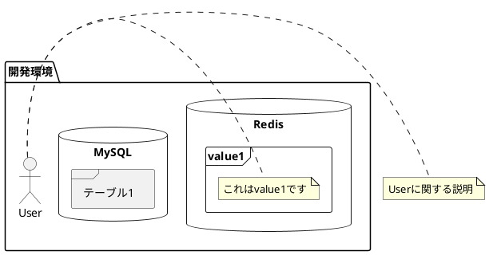
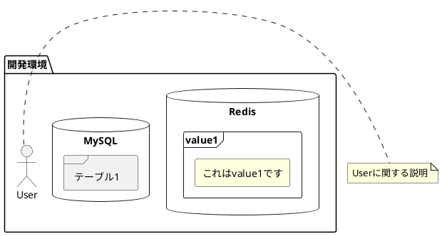
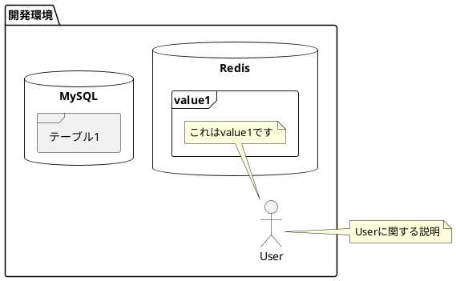

## 解決したいこと



「これはvalue1です」からUserに意図しない点線が出てしまっているので削除したい

:::note info
PlantUMLのソースがみたい方は「Markdownで本文を見る」をクリックしてください。

:::

---

## 暫定対応

noteを使うのをやめて`[]`で囲むことにした。
デフォルトだと灰色なので，`#FFFFE0`を指定している。



---

## 試したこと

### △noteの配置位置を変える

`right`を`top`に変えると吹き出しにはなったが，別にこれもいらない

```
        frame "value1" as value1 {
            note top : これはvalue1です
        }
```



### ✖点線を透明にしてみる

```
skinparam noteConnectionColor transparent
```
上記を追加するも透明にならず。
TODO: 他の指定方法なら消えるかも?


### ✖`right`等の場所指定表記を消す

試したが，構文エラーになった。

---

