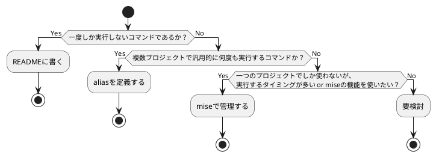

## これは何?

前記事ではmiseを使ってツールのバージョン管理を試してみた。

https://qiita.com/sigma_devsecops/items/078943677108e264c031

今回はmiseを使ってディレクトリごとにタスクランナーを定義することで、よく実行するコマンドを効率よく実行できるようにする手順を紹介する。

---

## ディレクトリごとにタスクランナーは本当に必要なのか

https://zenn.dev/loglass/articles/0016-make-makefile

https://www.takeokunn.org/posts/permanent/20250711132607-why_not_command_memo_makefile/

自分も最近これらの記事を読んだ。
(Makefileをタスクランナーとして使ったことがあるので興味深かった)

これを受けて、自分は以下の場合にはタスクランナーをプロジェクトに配置しても良いと考えている。

- 何度もコマンドを実行する
- 複数プロジェクトで汎用的に何度も実行するわけではない



---

## 実際にやってみる

### 単純なタスク化

自分はObsidianで作成したファイルをGitHubで管理している。
自分以外はpushしないし、ロールバックすることもないので

- git add
- git commt -m "本日の日付"
- git push -u origin main

を実行するのみで問題ない。

:::note info
ちなみに~/.config/mise/mise.tomlに記載するとどのディレクトリからでも使用可能なタスクランナーを定義できる。(個人的にはmiseの機能(タスクの依存関係や確認してから実行)などを使わないのであればaliasで十分だと思っている。
:::

```~/プロジェクト名/mise.toml
[tasks.git-push]
description = "Synchronize an Obsidian vault to a GitHub repo"
run = '''
git add .
git commit -m "feat: 2025-07-13"
git push -u origin main
'''
alias = "gp"
```

miseのいいところとしては[こちらの記事](https://zenn.dev/dress_code/articles/a99ff13634bbe6)でも触れられている通り、`mise run`すると使用可能なタスクランナーが一覧表示され、選択するだけでコマンドが実行できることである。
そのため、Makefileと異なり、コマンド名を忘れてしまっている場合でも、使用可能なタスクを確認は不要である。

```shell
mise run                                 130
Tasks
Select a task to run
❯ git-push  Synchronize an Obsidian vault to a GitHub repo
❯ その他のツール  hogehoge
/ 
esc clear filter • enter confirm
```

:::note info

タスクランナーを指定して実行することも可能。
```shell
mise run git-push
```
また、`mise.toml`にaliasを定義しているなら、aliasを指定して実行することも可能

```shell
mise run gp
```
:::

### miseの機能を使っていい感じにする

https://mise.jdx.dev/tasks/task-configuration.html

```mise.toml
[tasks.git-status]
description = "Show git status"
run = "git status"

[tasks.git-push]
description = "Synchronize an Obsidian vault to a GitHub repo"
confirm = "今日の作業は終わり!pushしてよい?"
run = '''
git add .
git commit -m "feat: $(date +'%Y-%m-%d')"
git push -u origin main
'''
alias = "gp"
depends = ["git-status"]
```

この変更により、以下が可能になった
- `git-push`実行前に`git-status`タスクが実行される
- `git-push`時にユーザに確認を取る


---

## あとがき

- miseのtaskを指定してAIに指示を出すのも良さそう
    - 音声入力と親和性が高そう
    - ユーザに確認が必要な場合にはmiseの機能で確認を挟める。(AIがバイパスしそうな気はするが)
- 引数を受け取る機能があったと思うので、AIにコミット名とか決めて引数に渡して実行してもらえば、全リポジトリ共通で使えるようになりそう。
    - プロンプトでつらつら書くならコマンド化したほうが良さそう。[参考](https://qiita.com/sigma_devsecops/items/db6344e479cdcabe0705)
