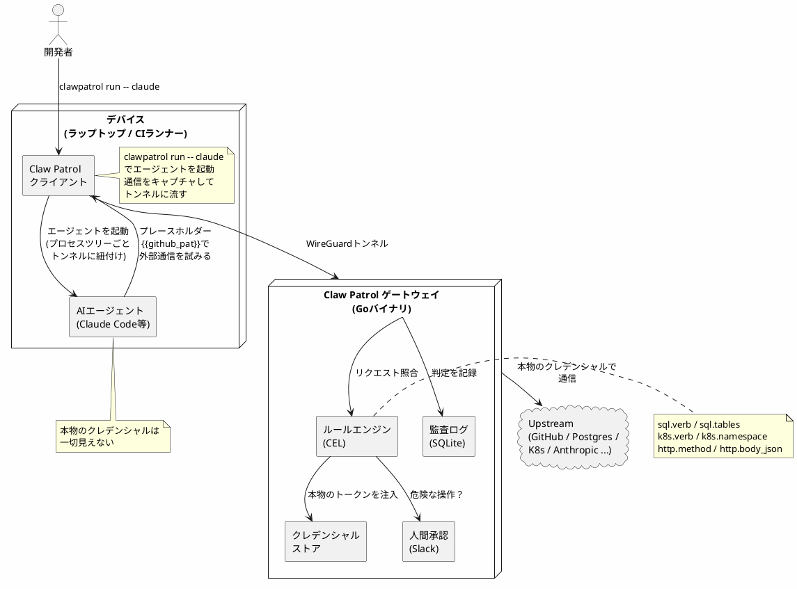

## これは何?

https://deno.com/blog/clawpatrol

[Deno](https://deno.com/)が出した、新しいOSSである[Claw Patrol](https://github.com/denoland/clawpatrol)というAIエージェントのためのファイアウォールが登場した。

エンタープライズで一元管理するにあたり、AIエージェントのセキュリティ問題を解決するのに良さそうと思ったので手元で試してみた。

---

## Claw Patrolはどんなツールなのか

端的に言うと、AIエージェントを外部から制御することができるツールだ。

Claude Codeの場合、settings.jsonでも許可しないコマンドなどは定義できるが、Claudeがバイパスした例も報告されている。

https://x.com/ryoppippi/status/2044929995743564206?s=20

また、プロンプトインジェクションなどにより、AIエージェントに想定外の操作をさせる攻撃や、[AIの暴走により本番DBが削除される事件](https://www.tomshardware.com/tech-industry/artificial-intelligence/claude-powered-ai-coding-agent-deletes-entire-company-database-in-9-seconds-backups-zapped-after-cursor-tool-powered-by-anthropics-claude-goes-rogue)も発生しており、AIエージェントに対してどのようにガードレールを設定するかは重要な課題となっている。

Claw PatrolはAIエージェントとは別のサーバ/別プロセスで独立に起動し、AIエージェントを制御できる。

https://clawpatrol.dev/docs/introduction/

> Claw Patrol is a firewall for AI agents. It sits between your agents and the internet, decides what each request is allowed to do, and stamps real credentials onto the wire so the agent never holds them.

Claw PatrolはAIエージェントのためのファイアウォールという記載があるが、単に特定の通信をブロックするだけではない。

クライアント(Claude Code等)とインターネットの間に配置され、以下の機能がある。

- すべてのアウトバウンドリクエストに対するAllow/Denyルールの適用: 設定ファイルはHCLで記述し、細かい条件はCEL(Common Expression Language)で書ける
- HTTP以外のプロトコルに対してもワイヤプロトコルを終端する
- リスクのあるアクションに対する承認機能
- Claw Patrolでクレデンシャルを管理、注入
- すべての通信記録をログとして残す



### Claw Patrolを推す理由

#### オープンソースであること

本番環境で使用するクレデンシャルを登録するツールであれば、ソース公開されているほうが圧倒的に安心であるため。

#### ワイヤプロトコルを終端し、通信内容を制御できる

https://clawpatrol.dev/docs/architecture/

> Each plugin owns the per-protocol decode: an https endpoint sees parsed http.Request objects; a postgres endpoint sees Query / Parse messages; a clickhouse_native endpoint sees Hello packets; an ssh endpoint sees channels and global requests.

プロトコルごとに通信をデコードしたうえで制御しているので、単なるホスト単位の遮断にとどまらず、HTTPのメソッドやパス、SQLのクエリやテーブル、Kubernetesの操作といった粒度でルールを書ける。

#### AIエージェントに一切クレデンシャルを触れない設計

> Secret injection at the wire. Agents send placeholders ({{github_pat}}); the gateway swaps them for the real token in transit.[Claw Patrol Introductionより](https://clawpatrol.dev/docs/introduction/)

AIエージェントはクレデンシャルを`{{github_pat}}`のようにプレースホルダーとして送信し、Claw Patrolのゲートウェイが本物のクレデンシャルに差し替えたうえで通信する。
これにより、プロンプトインジェクションによるクレデンシャルの吸い出しや、ログに誤って出力されてしまう事故を防ぐことができる。

#### すべてのコマンドで使える

基本的には`clawpatrol run -- claude`のようにAIエージェントを引数で渡すことが多いが、他のコマンドも渡すことができる。

Claw Patrolは全ての攻撃通信を遮断できるわけではないが、開発者が誤って[悪意のある偽サイト](https://socprime.com/ja/active-threats/fake-homebrew-ad-leads-to-macsync-stealer-infection/)のインストールコマンドを実行してしまった際にも`clawpatrol run`を挟んでおけば、被害を削減できる可能性がある。

---

## とりあえず、使ってみた

:::note info
クレデンシャルを使う環境が手元でパッと用意できなかったので、ドメイン単位のブロックはできるかで動作確認を実施した。
後日、別の検証を実施して追記予定。
:::

### 環境

- Ubuntu 24.04 LTSのlocalhostでClaw Patrolのゲートウェイを立ち上げ、同端末上から使用
- clawpatrol 0.2.2 (271ceb35c27716d6be61cfe461cd4aabf0479d0c)
- 動作検証日: 2026年5月25日

### インストール

[公式サイト](https://github.com/denoland/clawpatrol)に沿って使ってみる。

```shell
curl -fsSL https://clawpatrol.dev/install.sh | sh
```

自分の環境ではshellを再起動したらパスが通った。

```shell
which clawpatrol
/home/sigma/.local/bin/clawpatrol
```

### ゲートウェイ作成

AIエージェントが使用するゲートウェイを使用する。本来は別サーバで起動し、ユーザ共通で使用するものと思われるが、今回はローカル端末で起動する。

ゲートウェイの定義はTerraformでおなじみのHCLを使用する。

とりあえず、`/home/sigma/test.hcl`をClaudeに作ってもらった。

実験項目としてはドメイン単位のブロックはできるかという観点で`google.com`をブロックしてみる。

```test.hcl
# Claw Patrol gateway config — ローカル体験用の最小構成
gateway {
  dashboard_listen = "127.0.0.1:8080"

  # クライアント(=このマシンの claude)が join 時にダイヤルする先。
  # ローカル同一マシンなのでダッシュボードと同じ http://localhost:8080 に揃える。
  # 実環境では公開ホスト名(https)にする。
  public_url = "http://localhost:8080"

  # DB・クレデンシャル・WGピア情報などの永続化先。
  # gateway を root で動かす想定なのでこの場所でも書ける。存在しなければ作られる。
  state_dir = "/home/sigma/ailab/clawpatrol-state"

  wireguard {
    subnet_cidr = "10.55.0.0/24"
    # listen_port はデフォルト 51820
  }
}

defaults {
  # 公式 docs では unknown_host が取れる値は passthrough(デフォルト)か close で、
  # 未マッチの SNI を「そのまま通す」か「閉じる」かを決める(deny という値は無い)。
  # 実測でも unknown_host="deny" は close されず passthrough 相当の挙動になった。
  # 未定義ホストをまとめて遮断したい場合は close を使う。
  # なお verdict="deny" は endpoint 個別の rule で使う値で、ここでの設定とは別物。
  # 今回は明示的に endpoint を定義して deny ルールでブロックを観察するため passthrough にしている。
  unknown_host     = "passthrough"
  llm_fail_mode    = "closed"
  llm_cache_ttl    = 300
  human_timeout    = 600
  human_on_timeout = "deny"
}

# ── endpoints ────────────────────────────────────────────────
# Claude Code 自身が話す先
endpoint "https" "anthropic" { hosts = ["api.anthropic.com"] }

# デモ用: まるごとブロックする先
endpoint "https" "google" {
  hosts = ["google.com", "www.google.com"]
}

# ── credentials ──────────────────────────────────────────────
# Claude Pro/Max サブスクの OAuth。初回ダッシュボード訪問時に認可フローを通す。
credential "anthropic_oauth_subscription" "claude" {
  endpoint = https.anthropic
}

# google を profile 閉包に入れて arm するためだけのダミー。
# google-block で deny されるので、トークン値は注入されない（空でよい）。
credential "bearer_token" "google" {
  endpoint = https.google
}

# ── rules ────────────────────────────────────────────────────
# anthropic は全許可（Claude Code が動くため）
rule "anthropic-allow" {
  endpoint = https.anthropic
  verdict  = "allow"
}

# google: 全メソッド・全パスを拒否（ブロックの挙動を観察するデモ）
rule "google-block" {
  endpoint = https.google
  verdict  = "deny"
  reason   = "demo: google.com への通信はブロック"
}

# ── profiles ─────────────────────────────────────────────────
# 参加デバイスに割り当てるクレデンシャルの集合
profile "default" {
  credentials = [anthropic_oauth_subscription.claude, bearer_token.google]
}

```

以下のコマンドでゲートウェイを立ち上げる。`--set-dashboard-password`で管理画面のパスワードを決めておくと楽。

```shell
clawpatrol gateway --set-dashboard-password "password" /home/sigma/ailab/test.hcl
```

:::note info

管理画面のパスワードを設定しない場合、接続時にパスワードを設定する必要がある。
:::

### 管理画面にアクセスしてみる

さっきの`test.hcl`の設定にあるように `localhost:8080`に行くと、管理画面にアクセスできる。
passwordは先程、設定した`password`を入力する。


### 端末をゲートウェイに追加する

```shell
clawpatrol join http://localhost:8080

Verify code in browser:

    WLLA-5468

http://localhost:8080/#/onboard/WLLA-5468

CA fingerprint: xxxxxxxxxxxxxxxxxxxxx
```

出力にあるように、`http://localhost:8080/#/onboard/WLLA-5468`にブラウザでアクセスする。

:::note warn
自分は初回のみ、以下のエラーが表示された。


This site can't be reached
が表示された場合には、`http://127.0.0.1:8080/#/onboard/WLLA-5468`のように127.0.0.1を直接指定すればうまくいった。
:::

成功すると、管理画面に端末が追加される。


### Claw Patrol経由でClaude Codeを使う

#### まず、Claw Patrol経由でのコマンド実行を試す

とりあえず、`curl`を叩いてみるとnamespacesを作る権限エラーになるので、一時的に解除する。

```shell
clawpatrol run -- curl example.com
warning: AppArmor may block TUN in user namespaces.
  if `clawpatrol run` fails: sudo sysctl -w kernel.apparmor_restrict_unprivileged_userns=0
clawpatrol: open tun: TUNSETIFF: operation not permitted
```

一時的に解除するため、以下を実施。

```shell
sudo sysctl -w kernel.apparmor_restrict_unprivileged_userns=0
```

```shell
clawpatrol run -- curl example.com
<!doctype html><html lang="en"><head><title>Example Domain</title><meta name="viewport" content="width=device-width, initial-scale=1"><style>body{background:#eee;width:60vw;margin:15vh auto;font-family:system-ui,sans-serif}h1{font-size:1.5em}div{opacity:0.8}a:link,a:visited{color:#348}</style></head><body><div><h1>Example Domain</h1><p>This domain is for use in documentation examples without needing permission. Avoid use in operations.</p><p><a href="https://iana.org/domains/example">Learn more</a></p></div></body></html>
```

次に明示的にブロックしている`google.com`にアクセスしてみる。

```shell
# 直接はいける
curl google.com
<HTML><HEAD><meta http-equiv="content-type" content="text/html;charset=utf-8">
<TITLE>301 Moved</TITLE></HEAD><BODY>
<H1>301 Moved</H1>
The document has moved
<A HREF="http://www.google.com/">here</A>.
</BODY></HTML>

# Claw Patrol経由はつながらない
clawpatrol run -- curl google.com
curl: (6) Could not resolve host: google.com
```

#### Claude Codeをつないでみる

そのまま実行すると何度`/login`を実行してもClaude Codeの初回ログインが成功しない。

Claw Patrolの管理画面でクレデンシャルを追加してやる必要がある。

設定画面からClaudeを選択し、Connectする。


準備ができたのでClaude Codeを起動する。

```shell
clawpatrol run -- claude
```

claude君が`google.com`につながらないと言っているので実験成功


---

## まとめ

Claw Patrolを使うことでAIエージェントを外部から制御することができ、AIエージェントを自律的に動作させる際のガードレールとして使用できそうと思った。

特にエンタープライズの分野ではセキュリティや監査の観点でも役に立ちそうなため、注目のOSSであると思う。
