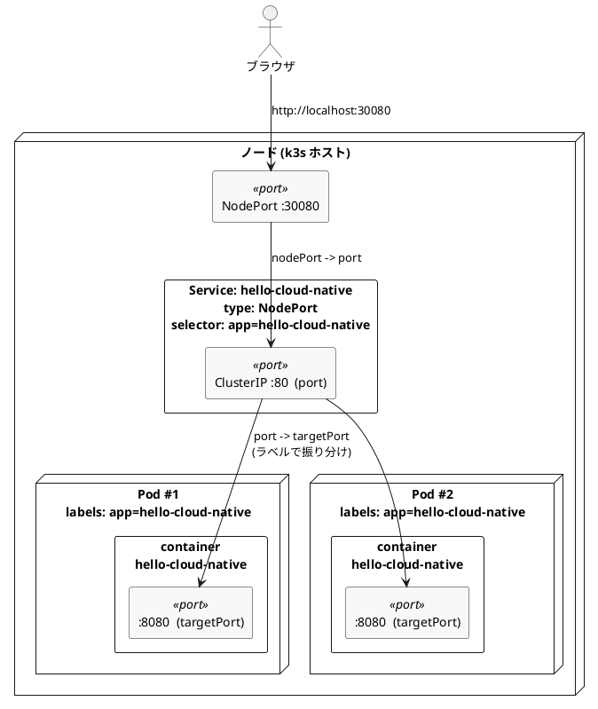

## 概要

:::note info
本記事は社内のクラウドネイティブ勉強会で使用した資料である。
:::

---

[Haskell](https://www.haskell.org/)が大好きなので、Haskellで作ったバイナリを[Kubernetes](https://kubernetes.io/ja/)(以降k8sと記載)で動かしてみたいと思った。

Amazon [EKS](https://aws.amazon.com/jp/eks/)やAzureの[AKS](https://azure.microsoft.com/ja-jp/products/kubernetes-service)なんかで最終的には動かしたいのだが、個人開発の場合オーバースペックすぎる。
(根がケチなので、[ロマン砲](https://dic.pixiv.net/a/%E3%83%AD%E3%83%9E%E3%83%B3%E7%A0%B2)的な概念は大好きだけれど手が出ない)

---

そこで、ローカルでk8sを動かすところから始めてみることにした。

調べたところ[k3s](https://k3s.io/)という軽量版のk8sがあるらしいことがわかったので、今回はこれを使ってHaskell製バイナリを動かすところまでやってみる。

### 環境

- OS: Ubuntu 24.04 LTS (x86_64)
- GHC: 9.12.2
- podman: 4.9.3
- k3s: v1.36.2+k3s1 (01b6f04a)
- 実施時期: 2026年7月

---

## そもそものモチベーション Why Haskell?

自分はこの1年近く、Haskellで競技プログラミングをしており、Haskellを実環境で使えないかということを模索している。

なぜなら、Haskellはとても美しい言語だからだ。

自分はまだそのポテンシャルを完全には引き出せていないが、それでも実環境で使う道を探りたいと思っている。

Haskellについて学ぶのは本発表の目的と若干ずれるので、詳しいことは自分の過去記事を参照されたし。

https://qiita.com/sigma_devsecops/items/3f2a397e944401fcc6cb

https://qiita.com/sigma_devsecops/stocks/44c627e9e285346cb28c

---

簡単な特徴だけ列挙しておく。

- 純粋関数型プログラミング言語
- 強い型
- 遅延評価

これらの特徴を備えていることで、豊かな表現力を備え、堅牢で美しいコードを書くことができる。

---

一方で、Haskellの言語設計上、パフォーマンスが極端に悪くなる書き方が存在する。

https://qiita.com/sigma_devsecops/items/206874ce5130abe280da

つまり、多少クセがあるがおもろい言語くらいに思ってくれればとりあえずよい。

---

### クラウドネイティブとは

https://news.livedoor.com/pr_article/detail/31930920/

弊社のメンバーが執筆に携わったクラウドネイティブ教科書(わかりやすくてめちゃくちゃよかった)によると、クラウドネイティブとはクラウドサービスやコンテナ技術の総称ではなく、変化・拡張・自動化を前提とした構造を指す。

一言で言うとシステムが変化することを前提に置き、責任の境界を再定義した考え方と自分は解釈した。

e.g. コンテナはアプリケーションの実行環境という形で、マイクロサービスは業務ドメインという形で、それぞれシステムの単位を再定義している。

---

Haskellもレイヤーは違うものの、純粋関数と型を用いて、副作用のある処理と純粋な処理の間に境界を設けている。
この境界の再定義という考え方がクラウドネイティブと相性がいいのではないかと直感的に感じたため、Haskellでクラウドネイティブやってみるモチベーションになっている。

---

### Haskellを他の言語と速度面だけ比較する

クラウドネイティブというとなんとなく、Goが使われる印象がある。
Goはなぜ、クラウドネイティブで採用されるのだろうか。
エコシステムが整っている点も理由の1つだろう。

ただしAI時代の今なら、足りないライブラリを自前で用意することも現実的になってきた。だとすればHaskellでクラウドネイティブやれるんじゃね?というのが最初のモチベーションである。

---

実はエコシステムが整っていないことだけがボトルネックだったりしやしないかと淡い期待のもと、とりあえずHaskellがどの程度遅いのかを調べてみた。
なぜ、速度を調べたかと言うと、自分がHaskellで競技プログラミングをやっていてそれなりに遅いなと感じる場面があるからである。

---

速度は[Benchmarks Game](https://benchmarksgame-team.pages.debian.net/benchmarksgame/measurements/ghc.html)の結果を使用し、実行時間とメモリ使用量を表に整理したのが以下である。
Haskell以外の4言語の測定ページはReferenceにまとめて記載しているので、数値を突き合わせたい場合はそちらを参照されたし。

---

数値の採用基準は次のとおり。

- 25.03 Benchmarks Game、2026年8月4日閲覧
- 各ベンチマークの最大入力(binary-trees n=21、fasta n=25,000,000など)における、elapsed secsが最速のプログラムを1つ選ぶ
- メモリ使用量は、その最速プログラムと同じ行の値を使う(実行時間とメモリで別のプログラムを混ぜない)
- Bad OutputなどでマークされたプログラムはBenchmarks Game側で失敗扱いなので除外する
- 処理系は各測定ページ記載のもの: clang 19.1.1 / Rust 1.84.1 / Java 23 HotSpot / GHC 9.10.1 / Go 1.23.1

なお、測定ページのGHCは9.10.1であり、本記事の実行環境(GHC 9.12.2)で測ったものではない点には注意されたし。

---

#### 実行時間(秒)

<table>
<thead>
<tr><th>ベンチマーク</th><th>C clang</th><th>Rust</th><th>Java</th><th>Haskell</th><th>Go</th></tr>
</thead>
<tbody>
<tr><td>binary-trees</td><td style="text-align:right">1.68</td><td style="text-align:right">1.06</td><td style="text-align:right">2.62</td><td style="text-align:right">2.16</td><td style="text-align:right">14.21</td></tr>
<tr></tr>
<tr><td>fannkuch-redux</td><td style="text-align:right">2.25</td><td style="text-align:right">3.81</td><td style="text-align:right">10.48</td><td style="text-align:right">9.69</td><td style="text-align:right">8.36</td></tr>
<tr></tr>
<tr><td>fasta</td><td style="text-align:right">0.78</td><td style="text-align:right">0.78</td><td style="text-align:right">1.20</td><td style="text-align:right">0.87</td><td style="text-align:right">1.27</td></tr>
<tr></tr>
<tr><td>k-nucleotide</td><td style="text-align:right">6.34</td><td style="text-align:right">2.57</td><td style="text-align:right">4.94</td><td style="text-align:right">23.30</td><td style="text-align:right">7.58</td></tr>
<tr></tr>
<tr><td>mandelbrot</td><td style="text-align:right">1.23</td><td style="text-align:right">0.95</td><td style="text-align:right">4.16</td><td style="text-align:right">1.39</td><td style="text-align:right">3.77</td></tr>
<tr></tr>
<tr><td>n-body</td><td style="text-align:right">2.20</td><td style="text-align:right">2.19</td><td style="text-align:right">6.92</td><td style="text-align:right">6.41</td><td style="text-align:right">6.38</td></tr>
<tr></tr>
<tr><td>pidigits</td><td style="text-align:right">0.74</td><td style="text-align:right">0.71</td><td style="text-align:right">0.84</td><td style="text-align:right">1.49</td><td style="text-align:right">0.82</td></tr>
<tr></tr>
<tr><td>regex-redux</td><td style="text-align:right">0.84</td><td style="text-align:right">0.78</td><td style="text-align:right">1.60</td><td style="text-align:right">1.10</td><td style="text-align:right">3.23</td></tr>
<tr></tr>
<tr><td>reverse-complement</td><td style="text-align:right">0.46</td><td style="text-align:right">0.55</td><td style="text-align:right">3.20</td><td style="text-align:right">3.11</td><td style="text-align:right">1.93</td></tr>
<tr></tr>
<tr><td>spectral-norm</td><td style="text-align:right">0.39</td><td style="text-align:right">0.72</td><td style="text-align:right">1.61</td><td style="text-align:right">1.49</td><td style="text-align:right">1.43</td></tr>
</tbody>
</table>

---

#### メモリ使用量(MB、小数第1位)

<table>
<thead>
<tr><th>ベンチマーク</th><th>C clang</th><th>Rust</th><th>Java</th><th>Haskell</th><th>Go</th></tr>
</thead>
<tbody>
<tr><td>binary-trees</td><td style="text-align:right">172.1</td><td style="text-align:right">135.9</td><td style="text-align:right">1737.0</td><td style="text-align:right">222.5</td><td style="text-align:right">620.7</td></tr>
<tr></tr>
<tr><td>fannkuch-redux</td><td style="text-align:right">2.9</td><td style="text-align:right">3.9</td><td style="text-align:right">61.2</td><td style="text-align:right">9.2</td><td style="text-align:right">3.8</td></tr>
<tr></tr>
<tr><td>fasta</td><td style="text-align:right">2.2</td><td style="text-align:right">4.7</td><td style="text-align:right">66.5</td><td style="text-align:right">14.1</td><td style="text-align:right">12.3</td></tr>
<tr></tr>
<tr><td>k-nucleotide</td><td style="text-align:right">131.0</td><td style="text-align:right">135.8</td><td style="text-align:right">448.5</td><td style="text-align:right">844.4</td><td style="text-align:right">164.2</td></tr>
<tr></tr>
<tr><td>mandelbrot</td><td style="text-align:right">35.8</td><td style="text-align:right">34.8</td><td style="text-align:right">98.9</td><td style="text-align:right">57.3</td><td style="text-align:right">37.1</td></tr>
<tr></tr>
<tr><td>n-body</td><td style="text-align:right">2.4</td><td style="text-align:right">3.0</td><td style="text-align:right">59.2</td><td style="text-align:right">9.8</td><td style="text-align:right">3.1</td></tr>
<tr></tr>
<tr><td>pidigits</td><td style="text-align:right">3.9</td><td style="text-align:right">4.0</td><td style="text-align:right">59.0</td><td style="text-align:right">22.4</td><td style="text-align:right">6.3</td></tr>
<tr></tr>
<tr><td>regex-redux</td><td style="text-align:right">156.0</td><td style="text-align:right">153.8</td><td style="text-align:right">377.4</td><td style="text-align:right">349.0</td><td style="text-align:right">290.8</td></tr>
<tr></tr>
<tr><td>reverse-complement</td><td style="text-align:right">502.0</td><td style="text-align:right">500.9</td><td style="text-align:right">2053.8</td><td style="text-align:right">510.8</td><td style="text-align:right">1247.7</td></tr>
<tr></tr>
<tr><td>spectral-norm</td><td style="text-align:right">4.6</td><td style="text-align:right">3.9</td><td style="text-align:right">61.3</td><td style="text-align:right">9.8</td><td style="text-align:right">4.1</td></tr>
</tbody>
</table>

---

これだけを見ると、CとRustは安定して速い。一方でHaskellは、GoやJavaと比べて速度面で極端に劣るわけではないように見える。
~~(あれ?Goさん基本アルゴリズムのbinary-trees遅すぎじゃないですか??)~~

なんだか想像以上にベンチマークが悪くなかったので、これワンちゃんあるんじゃね?と思い、k8sでHaskellを動かしてみることにした。ただしローカルで試すにはk3sが軽くて良さそうだったので、今回はこちらを使う。

---

## k3sとは

https://k3s.io/

[GitHub Repo](https://github.com/k3s-io/k3s/)のREADMEベースでk3sの特徴を紹介する。

- メモリフットプリントがk8sより小さい(名前の由来として「半分」を目標に掲げている)
  - IoTやCI、組み込みのような用途で使える
- 単一バイナリで100 MB未満
- k8sやそのほかのコンポーネントを1つのランチャーアプリにまとめている

つまり、軽量版k8sと思っておけばよい。

---

:::note info

名前の由来がおもしろかったので貼っておく
> What's with the name?
>
> We wanted an installation of Kubernetes that was half the size in terms of memory footprint. Kubernetes is a 10 letter word stylized as k8s. So something half as big as Kubernetes would be a 5 letter word stylized as K3s. A '3' is also an '8' cut in half vertically. There is neither a long-form of K3s nor official pronunciation.
:::

---

### k3s install

[公式](https://k3s.io/)の通りinstallするだけ。

```shell
curl -sfL https://get.k3s.io | sh -
# Check for Ready node, takes ~30 seconds
sudo k3s kubectl get node
```

---

## Haskellバイナリが動作するイメージを作る

ここから実践編に突入する。

[最終成果物](https://github.com/RyosukeDTomita/k3s-playground)はこちら

---

### とりあえず、Haskellバイナリを作ってコンテナイメージにする

HaskellでJSONを返すだけのコードを書いた。

```haskell
{-# LANGUAGE OverloadedStrings #-}
{-# OPTIONS_GHC -Wunused-imports #-}

-- | Hello, Cloud Native!をJSONで返すだけのバックエンド。
module Main (main) where

import Control.Concurrent (myThreadId)
import Control.Exception (throwTo)
import Data.Aeson (KeyValue ((.=)), encode, object)
import Data.Maybe (fromMaybe)
import Data.Text (Text)
import Data.Text qualified as Text
import Network.HTTP.Types (status200)
import Network.Wai (Application, responseLBS)
import Network.Wai.Handler.Warp (run)
import System.Environment (lookupEnv)
import System.Exit (ExitCode (ExitSuccess))
import System.IO (BufferMode (LineBuffering), hSetBuffering, stdout)
import System.Posix.Signals (Handler (CatchOnce), installHandler, sigTERM)
import Text.Read (readMaybe)

main :: IO ()
main = do
  -- コンテナのログ(kubectl logs)にすぐ流れるよう行バッファリングにする。
  hSetBuffering stdout LineBuffering
  -- コンテナ内ではPID 1で動くためSIGTERMのデフォルト動作が無視される。
  -- ハンドラを入れないとk8sの停止時に猶予時間いっぱい待ってSIGKILLされる。
  mainThread <- myThreadId
  _ <- installHandler sigTERM (CatchOnce $ throwTo mainThread ExitSuccess) Nothing
  port <- lookupPort
  podName <- lookupPodName
  putStrLn $ "listening on port " <> show port <> " as " <> Text.unpack podName
  run port $ app podName

-- | PORT環境変数からポート番号を取得する(未設定・不正値なら8080)。
lookupPort :: IO Int
lookupPort = do
  maybePort <- lookupEnv "PORT"
  pure $ fromMaybe 8080 $ maybePort >>= readMaybe

-- | HOSTNAME環境変数からPod名を取得する(未設定なら"unknown")。
-- k8sではコンテナのホスト名=Pod名がHOSTNAMEに入るので、
-- どのレプリカが応答したかをレスポンスで確認できる。
lookupPodName :: IO Text
lookupPodName = do
  maybeName <- lookupEnv "HOSTNAME"
  pure $ maybe "unknown" Text.pack maybeName

-- | どのパスへのリクエストにも自分のPod名入りのJSONを返すApplication。
app :: Text -> Application
app podName _request respond =
  respond $ responseLBS status200 [("Content-Type", "application/json")] body
  where
    body =
      encode $
        object
          [ "message" .= ("Hello, Cloud Native!" :: Text),
            "pod" .= podName
          ]
```

---

これをバイナリにしてとりあえず、コンテナイメージを作ってみる([こちらのブランチ](https://github.com/RyosukeDTomita/k3s-playground/tree/podman-build)を参照)。

```dockerfile:Containerfile.glibc-dynamic
FROM debian:bookworm-slim AS builder

RUN apt-get update && apt-get install -y --no-install-recommends \
    curl gcc g++ make libgmp-dev libffi-dev zlib1g-dev ca-certificates xz-utils \
    && rm -rf /var/lib/apt/lists/*

ENV BOOTSTRAP_HASKELL_NONINTERACTIVE=1 \
    BOOTSTRAP_HASKELL_GHC_VERSION=9.12.2 \
    BOOTSTRAP_HASKELL_CABAL_VERSION=latest \
    BOOTSTRAP_HASKELL_INSTALL_NO_STACK=1 \
    GHCUP_INSTALL_BASE_PREFIX=/opt \
    PATH=/opt/.ghcup/bin:$PATH

RUN curl --proto '=https' --tlsv1.2 -sSf https://get-ghcup.haskell.org | sh

WORKDIR /src
COPY hello-cloud-native.cabal ./
COPY app ./app

RUN cabal update && \
    cabal build --ghc-options='-split-sections' exe:hello-cloud-native && \
    cp "$(cabal list-bin exe:hello-cloud-native)" /tmp/hello-cloud-native && \
    strip /tmp/hello-cloud-native

FROM debian:bookworm-slim
RUN apt-get update && apt-get install -y --no-install-recommends libgmp10 \
    && rm -rf /var/lib/apt/lists/*
COPY --from=builder /tmp/hello-cloud-native /usr/local/bin/hello-cloud-native
ENV PORT=8080
EXPOSE 8080/tcp
USER 65534:65534
ENTRYPOINT ["/usr/local/bin/hello-cloud-native"]
```

---

```shell
podman build -f Containerfile.glibc-dynamic -t hello-cloud-native:glibc-dynamic .
podman images localhost/hello-cloud-native:glibc-dynamic
REPOSITORY                    TAG            IMAGE ID      CREATED       SIZE
localhost/hello-cloud-native  glibc-dynamic  954678ebe04a  13 hours ago  91.6 MB
```

91.6 MBはでかい...

---

### イメージサイズを小さくするために、musl静的バイナリにする

さすがにイメージサイズがでかすぎるので小さくする方法を検討する。

最初に思いついたのは、軽いベースイメージを使うことだ。

そのため、軽量イメージで動作するように[musl](https://www.musl-libc.org/intro.html)の静的バイナリでビルドするように変更する。

musl静的バイナリを使うことでHaskellのランタイムに必要な`libc`をバイナリに含めつつ、外部依存がないバイナリを生成できる。

---


💪💪💪💪💪💪💪💪💪💪💪💪💪

---

```dockerfile:Containerfile.musl-static
FROM alpine:3.20 AS builder

RUN apk add --no-cache \
    curl gcc g++ musl-dev make perl xz tar \
    gmp-dev libffi-dev ncurses-static ncurses-libs zlib-dev zlib-static

ENV BOOTSTRAP_HASKELL_NONINTERACTIVE=1 \
    BOOTSTRAP_HASKELL_GHC_VERSION=9.12.2 \
    BOOTSTRAP_HASKELL_CABAL_VERSION=latest \
    BOOTSTRAP_HASKELL_INSTALL_NO_STACK=1 \
    GHCUP_INSTALL_BASE_PREFIX=/opt \
    PATH=/opt/.ghcup/bin:$PATH

RUN curl --proto '=https' --tlsv1.2 -sSf https://get-ghcup.haskell.org | sh

WORKDIR /src
COPY hello-cloud-native.cabal ./
COPY app ./app

RUN cabal update && \
    cabal build --ghc-options='-optl-static -optl-pthread -split-sections' exe:hello-cloud-native && \
    cp "$(cabal list-bin exe:hello-cloud-native)" /tmp/hello-cloud-native && \
    strip /tmp/hello-cloud-native

FROM scratch
COPY --from=builder /tmp/hello-cloud-native /hello-cloud-native
ENV PORT=8080
EXPOSE 8080/tcp
# 非rootで実行する(scratchに/etc/passwdはないので数値UID/GID指定)
USER 65534:65534
ENTRYPOINT ["/hello-cloud-native"]
```

```shell
podman build -f Containerfile.musl-static -t hello-cloud-native:musl-static .
podman images hello-cloud-native:musl-static
REPOSITORY                    TAG          IMAGE ID      CREATED       SIZE
localhost/hello-cloud-native  musl-static  a51d1cd78d25  15 hours ago  28.9 MB
```

---

:::note info

イメージは小さくなったが、musl静的バイナリのほうが動的バイナリよりもバイナリサイズ自体は大きくなる。

```shell
# 動的リンクバイナリ
cid=$(podman create localhost/hello-cloud-native:glibc-dynamic)
podman cp "$cid:/usr/local/bin/hello-cloud-native" ./glibc-dynamic-bin
ls -lh glibc-dynamic-bin
-rwxr-xr-x 1 sigma sigma 14M  7月 30 22:24 glibc-dynamic-bin*

# musl静的バイナリ
cid=$(podman create localhost/hello-cloud-native:musl-static)
podman cp "$cid:/hello-cloud-native" ./musl-static-bin
ls -lh musl-static-bin
-rwxr-xr-x 1 sigma sigma 28M  7月 30 21:49 musl-static-bin*
```

```shell
# イメージサイズ確認
podman images localhost/hello-cloud-native
REPOSITORY                    TAG            IMAGE ID      CREATED       SIZE
localhost/hello-cloud-native  glibc-dynamic  954678ebe04a  19 hours ago  91.6 MB
localhost/hello-cloud-native  musl-static    a51d1cd78d25  19 hours ago  28.9 MB
```

<table>
<thead>
<tr><th></th><th>イメージサイズ</th><th>バイナリ単体</th></tr>
</thead>
<tbody>
<tr><td>glibc-dynamic</td><td>91.6 MB</td><td>14 MB (動的リンク)</td></tr>
<tr></tr>
<tr><td>musl-static</td><td>28.9 MB</td><td>28 MB (静的リンク)</td></tr>
</tbody>
</table>

:::

これで、イメージサイズを28.9 MBまで削減できた。

---

### Nix-Flakeでイメージを作ってみる

最近自分は、[Nix-Flake](https://wiki.nixos.org/wiki/Flakes/ja)で環境構築を行うようにしている。

Nixパッケージマネージャーに追加された実験的新機能 (Nix 2.4 / 2021年11月〜)であり、Nix言語で開発環境・ビルド・依存関係をすべて宣言的に管理する仕組みである。
(個人的な体感だが、2025年秋くらいからAIありきなら学習コストが高くないため、流行しているイメージがある)

Nix-Flakeに興味がある方は以下を参照されたし。

https://qiita.com/sigma_devsecops/items/b9b0597d684775fb8955

https://syu-m-5151.hatenablog.com/entry/2025/12/18/111500

https://zenn.dev/trifolium/books/1c0373f3570334

---

Nix-Flakeはすべての依存をフルコミットハッシュで管理し、その依存ツリーをもとにビルドする。そのため実行タイミングや環境の差異に左右されない、再現性の高い開発環境を作れる。

実際にリビジョンを固定しているのは`flake.lock`のほうなので、本記事で使った正確なバージョンは[最終成果物のリポジトリ](https://github.com/RyosukeDTomita/k3s-playground)の`flake.lock`を参照してほしい。

---

さらに、Nix-Flakeを使うとDockerfileなどを書かずにバイナリを生成し、コンテナイメージまで作れる。
`dockerTools.buildLayeredImage`はベースイメージを指定しなければ何も土台を敷かないので、musl-staticのときの`FROM scratch`と同じく「静的バイナリ1個だけが入ったイメージ」になる。

---

```nix:flake.nix
{
  description = "Haskell backend + distroless container image for k3s playground";

  inputs = {
    nixpkgs.url = "github:NixOS/nixpkgs/nixos-25.05";
    flake-utils.url = "github:numtide/flake-utils";
    treefmt-nix.url = "github:numtide/treefmt-nix";
  };

  outputs =
    {
      self,
      nixpkgs,
      flake-utils,
      treefmt-nix,
    }:
    flake-utils.lib.eachDefaultSystem (
      system:
      let
        pkgs = import nixpkgs { inherit system; };
        hpkgs = pkgs.haskell.packages.ghc9122;
        treefmtEval = treefmt-nix.lib.evalModule pkgs ./treefmt.nix;
        appSrc = pkgs.lib.fileset.toSource {
          root = ./.;
          fileset = pkgs.lib.fileset.unions [
            ./hello-cloud-native.cabal
            ./app
          ];
        };
        helloCloudNativeStatic = pkgs.haskell.lib.justStaticExecutables (
          pkgs.pkgsStatic.haskell.packages.ghc9122.callCabal2nix "hello-cloud-native" appSrc { }
        );
      in
      {
        formatter = treefmtEval.config.build.wrapper;

        # `nix build`でmusl静的バイナリを生成する(ローカル動作確認用)。
        packages.default = helloCloudNativeStatic;

        # `nix build .#image`でdistrolessなコンテナイメージ(tar.gz)を生成する。
        # ベースイメージなし: musl静的バイナリ1個だけが入る(シェルなし・glibcなし)。
        packages.image = pkgs.dockerTools.buildLayeredImage {
          name = "hello-cloud-native";
          tag = "latest";
          # イメージの作成日時。デフォルトはUnix epoch(1970-01-01)で
          # `docker images`に"56 years ago"と出るため、ビルド時刻を使う。
          # 注意: "now"にするとビルドごとに出力が変わり再現性は失われる
          #(hash固定を優先するなら"2026-07-16T00:00:00Z"のような固定値にする)。
          created = "now";
          config = {
            Cmd = [ "${helloCloudNativeStatic}/bin/hello-cloud-native" ];
            Env = [ "PORT=8080" ];
            ExposedPorts."8080/tcp" = { };
            # distroless流に非root(nobody)で実行する。
            User = "65534:65534";
          };
        };

        devShells.default = pkgs.mkShell {
          packages = [
            treefmtEval.config.build.wrapper
            pkgs.zsh
            (hpkgs.ghcWithPackages (ps: [
              ps.aeson
              ps.wai
              ps.warp
              ps.http-types
            ]))
            hpkgs.haskell-language-server
            pkgs.cabal-install
          ];
        };
      }
    );
}
```

---

```shell
nix build .#image -o result-image
```

:::note info
ビルドに時間がかかる場合には[app.cachix.org](https://app.cachix.org/)のようなリモートキャッシュを活用して効率化できる。
:::

---

イメージを試しにPodmanにloadしてみる。

```shell
podman load < result-image
podman images localhost/hello-cloud-native:latest
REPOSITORY                    TAG         IMAGE ID      CREATED      SIZE
localhost/hello-cloud-native  latest      b2faa9d6d665  2 weeks ago  3.25 MB
```

バイナリ単体のサイズは、イメージから取り出さなくても`nix build`でそのまま作れる構成にしてある。

```shell
nix build
ls -lh result/bin/hello-cloud-native
-r-xr-xr-x 2 root root 3.1M  1月  1  1970 result/bin/hello-cloud-native*
```

---

<table>
<thead>
<tr><th>構成</th><th>ビルド</th><th>ビルド環境</th><th>最終ベース</th><th>イメージサイズ</th><th>バイナリ単体</th></tr>
</thead>
<tbody>
<tr><td>glibc-dynamic</td><td>Podman</td><td><code>debian:bookworm-slim</code></td><td><code>debian:bookworm-slim</code></td><td>91.6 MB</td><td>14 MB (動的リンク)</td></tr>
<tr></tr>
<tr><td>musl-static</td><td>Podman</td><td><code>alpine:3.20</code> + ghcup</td><td><code>scratch</code> (ベースイメージなし)</td><td>28.9 MB</td><td>28 MB (静的リンク)</td></tr>
<tr></tr>
<tr><td>nix-flake</td><td>Nix</td><td>nixpkgs <code>pkgsStatic</code></td><td><code>scratch</code> (ベースイメージなし)</td><td>3.25 MB</td><td>3.2 MB (静的リンク)</td></tr>
</tbody>
</table>

このようにNix-Flakeとmusl静的バイナリを使うことでバイナリサイズを3.2 MBまで小さくできた。
ばんざーい!

---

:::note info
Nix-Flakeを使うとなぜバイナリを小さくすることができたのだろうか。

鍵は[`-split-sections`](https://downloads.haskell.org/ghc/9.12.2/docs/users_guide/phases.html#ghc-flag-split-sections)である。関数ごとにELFセクションを分け、リンク時に未使用のセクションを捨てさせるGHCのオプションで、実は上のContainerfileでも渡している。しかし効果は64バイトしかなかった。ghcupが配布するライブラリの一部がこのオプションなしでビルドされているからだ。

一方、nixpkgsは依存関係をすべてソースからビルドする仕組みになっていて、依存ライブラリのビルドが`split_sections`を指定して実行される。
そのため、依存ライブラリのバイナリサイズも小さくすることができる。

Containerfileの中でGHC自体を`split_sections`付きでビルドすれば同じ結果になるはずだが、Nix-Flakeの仕組みに乗るほうが楽ちんだと思う。
:::

---

### k3sに載せてみる

マニフェスト用に2つのファイルを作成した(1つのファイルにまとめることもできるが、今回は2つに分けてみた)。

`deployment.yaml`にPodの数などを宣言し、`service.yaml`のほうにネットワークの設定などを記載した。

---

```yaml:manifests/deployment.yaml
# hello-cloud-nativeのPodを2レプリカで維持するDeployment。
apiVersion: apps/v1
kind: Deployment
metadata:
  name: hello-cloud-native
  labels:
    app: hello-cloud-native
spec:
  replicas: 2
  selector:
    # このラベルにマッチするPodをこのDeploymentが管理する。
    # Service側のselectorとも揃える。
    # spec.template.metadata.labels.appともあわせる
    matchLabels:
      app: hello-cloud-native
  template:
    metadata:
      labels:
        app: hello-cloud-native
    spec:
      containers:
        - name: hello-cloud-native
          # k3sのcontainerdに`ctr images import`したローカルイメージを使う。
          # containerd内部の正規化された完全修飾名で指定する。
          image: docker.io/library/hello-cloud-native:latest
          # レジストリからpullせず、import済みイメージだけを使う。
          imagePullPolicy: Never
          ports:
            - containerPort: 8080
          env:
            - name: PORT
              value: "8080"
          # 3MBの静的バイナリ1個なのでリソースはごく小さくてよい。
          resources:
            requests:
              cpu: 10m
              memory: 16Mi
            limits:
              memory: 64Mi
          readinessProbe:
            httpGet:
              path: /
              port: 8080
          livenessProbe:
            httpGet:
              path: /
              port: 8080
          securityContext:
            runAsNonRoot: true
            allowPrivilegeEscalation: false
            readOnlyRootFilesystem: true
            capabilities:
              drop:
                - ALL
```

---

```yaml:manifests/service.yaml
# hello-cloud-nativeのPod群への入口となるService。
# NodePortなのでノードの30080番からアクセスできる。
apiVersion: v1
kind: Service
metadata:
  name: hello-cloud-native
  labels:
    app: hello-cloud-native
spec:
  type: NodePort
  # このselectorにマッチするPodへ振り分ける(Deployment側のラベルと揃える)。
  selector:
    app: hello-cloud-native
  ports:
  # ブラウザ ->  localhost:30080 -> ClusterIP:80 -> Pod/コンテナ:8080
    - name: http
      port: 80 # ClusterIPで受けるポート
      targetPort: 8080 # コンテナ側のポート
      nodePort: 30080 # ノード(ホスト)側のポート ここに向かってアクセスする。
```

---

マニフェストができたのでk3sにイメージをimportしてマニフェストを適用する。

```shell
# 1. イメージをビルド(すでにあれば不要)
nix build .#image -o result-image

# 2. k3s(containerd)にimport
zcat result-image | sudo k3s ctr images import -
sudo k3s crictl images | grep hello-cloud-native

# 3. マニフェストを適用
sudo k3s kubectl apply -f manifests/
sudo k3s kubectl get pods -l app=hello-cloud-native
```

---

図にするとこういう感じ。
ブラウザからアクセスする部分は`localhost:30080`になっていることに注意。



---

早速リクエストを投げる。

```shell
# -w '\n'でリクエストごとに改行を入れて結果を見てみる
for i in $(seq 5); do curl -s -w '\n' http://localhost:30080; done
{"message":"Hello, Cloud Native!","pod":"hello-cloud-native-777f8bf664-646g7"}
{"message":"Hello, Cloud Native!","pod":"hello-cloud-native-777f8bf664-6pn85"}
{"message":"Hello, Cloud Native!","pod":"hello-cloud-native-777f8bf664-646g7"}
{"message":"Hello, Cloud Native!","pod":"hello-cloud-native-777f8bf664-6pn85"}
{"message":"Hello, Cloud Native!","pod":"hello-cloud-native-777f8bf664-6pn85"}
```

レスポンスのPod名が切り替わっているので、いい感じにオーケストレーションされていそうだ。

---

ついでに、Podを手動で削除する実験も行った。

```shell
sudo k3s kubectl get pods -l app=hello-cloud-native
NAME                                  READY   STATUS    RESTARTS   AGE
hello-cloud-native-777f8bf664-646g7   1/1     Running   0          15h
hello-cloud-native-777f8bf664-6pn85   1/1     Running   0          15h
```

```shell
# Podを手動で削除して確認すると新しいPodが作成されている。
sudo k3s kubectl delete pod hello-cloud-native-777f8bf664-646g7
sudo k3s kubectl get pods -l app=hello-cloud-native -w
NAME                                  READY   STATUS    RESTARTS   AGE
hello-cloud-native-777f8bf664-6pn85   1/1     Running   0          15h
hello-cloud-native-777f8bf664-q4mfs   1/1     Running   0          116s
```

ちゃんとマニフェストに書いた状態を維持するようにk3sがPodを自動で立ち上げてくれた。

---

## まとめ

- Haskellとクラウドネイティブは境界の分離という点で(勝手に)相性がいいのではと思った。
- とりあえず、k3sで動かしてみた。
- イメージ作るにあたり、musl静的バイナリにするかつ、Nix-Flakeにすることでイメージサイズを91.6 MB -> 3.25 MBまで削減できた。
- まだまだ、道は遠いがHaskellでクラウドネイティブを個人的にやっていきたい。

---

## Reference

- [Benchmarks Game - Rust measurements](https://benchmarksgame-team.pages.debian.net/benchmarksgame/measurements/rust.html)
- [Benchmarks Game - Java measurements](https://benchmarksgame-team.pages.debian.net/benchmarksgame/measurements/javavm.html)
- [Benchmarks Game - Go measurements](https://benchmarksgame-team.pages.debian.net/benchmarksgame/measurements/go.html)
- [Benchmarks Game - Haskell GHC measurements](https://benchmarksgame-team.pages.debian.net/benchmarksgame/measurements/ghc.html)
- [Benchmarks Game - C clang measurements](https://benchmarksgame-team.pages.debian.net/benchmarksgame/measurements/clang.html)
