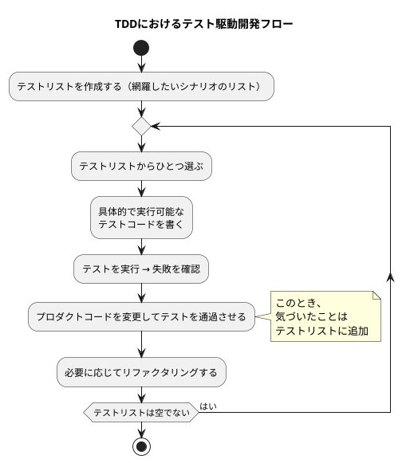

## これは何?

TDD(テスト駆動開発)のためのプロンプトをつくるために一旦ざっと集めたメモ

---

## TDDの定義

TDDは以下のサイクルで行うものである。

> 1. 網羅したいテストシナリオのリスト（テストリスト）を書く
> 2. テストリストの中から「ひとつだけ」選び出し、実際に、具体的で、実行可能なテストコードに翻訳し、テストが失敗することを確認する
> 3. プロダクトコードを変更し、いま書いたテスト（と、それまでに書いたすべてのテスト）を成功させる（その過程で気づいたことはテストリストに追加する）
> 4. 必要に応じてリファクタリングを行い、実装の設計を改善する
> 5. テストリストが空になるまでステップ2に戻って繰り返す
[^1]

[^1]をもとにplantumlを作成

テスト駆動開発の書籍[^2]では，以下のような記載もあるのでこれもメモしておく。

> 1. まずはテストを1つ書く [^2]
> 2. すべてのテストを走らせ，新しいテストの失敗を確認する
> 3. 小さな変更を行う
> 4. すべてのテストを走らせ，すべて成功することを確認する
> 5. リファクタリングを行って重複を除去する

[^1]のポイントだと思う部分を要約したのが以下

- テストリストを作る段階で期待される動作(振る舞い)をすべてリストアップすること(正常系，異常系についても考慮をする)。内部実装については考えない
- テストを1つずつ書くこと。まとめて書かない
- テストを通す時には通すことだけに集中する。リファクタリングはしない。
> このステップでは罪を犯しても良い[^3]
- 一つずつテストを書き，そのテストがパスすることをゴールにすること
- リファクタリングを初期の段階でやりすぎない

### TDDと誤解されがちな概念との整理

> テスト駆動開発（TDD）はテストファーストの利点を伸ばし、欠点を補うために生まれました。設計面でのテストファーストの強みを活かしつつ、保守性を上げるためにリファクタリングが組み込まれています。またやりすぎ、考えすぎ（スコープクリープ）を避けるために、イテレーティブな開発手順とインクリメンタルな設計の要素が組み込まれました。[^3]

:::note info
> イテレーティブな開発手順（繰り返しながら作る）[^3]
> インクリメンタルな設計（少しずつ作る）[^3]
:::

#### 自動テスト

> - テスティングフレームワークを使ってテストコードを書くこと（あるいは、書かれたテストコードそのもの）は「自動テスト（Automated Test）」と呼ばれます。誰が書いても構いません[^1]

[^2]の要約は以下

- 自己検証可能である
- テストが何度でも実行できること: テスト後に手動で作業が必要なのはNG
- ほかテストと独立しており，互いに影響しないこと
- 高速で動作すること

#### 開発者テスト

> - 開発者が自分でテストコードを書くこと、開発者自身が自動テストを書きながら開発することは「開発者テスト（Developer Testing）」と呼ばれます。テストコードを書くタイミングは後からでも構いませんが、実装を行うタイミングに近ければ近いほど効果が高まります

汎用性高そうだったのでこれは引用しておく

> 実装者本人が実装と近いタイミングでテストを書くと設計変更のハードルが下がり、現状の実装に対して無理やりテストを書くのではなく、実装のほうを、テストを書きやすい設計に変更できます。テストを書きやすい設計とは、「⁠責務が明確で、結合度が低く、凝集度が高く、決定的（deterministic）な動作をする」という、一般的にソフトウェアが備えていると良い性質を持った設計ということです。設計上の問題を早期に解決することで、手戻りを減らすことができます。[^3]

#### テストファースト

> - テストコードを実装よりも前に書くことは「テストファーストプログラミング（Test-First Programming）」あるいは短く「テストファースト」と呼ばれます。テストコードの書き手は開発者自身であることがほとんどです（が、開発する本人以外の人が先にテストコードを書くこともあります。他の人が書く場合はテスト駆動開発の構成要素にはなりません[^1]

これはどこかで使いたい文だと思ったので引用

> テスト可能なコードを書くにはテストファーストが最も有効というよりは、そうでもしないとテストは書けない、というのが現実的なところです。あとからテストを書くのが難しく、面倒なら、結局書かれないことが多いからです。テストファーストは、テスト可能なコードにたどり着く最も効果的な方法なのです。[^3]

> 先に実装を作ってから使うという順番では、すでに書いてしまった実装を使うようにバイアスが働いてしまいますが、テストファーストではそもそも存在しない実装を先に利用することで、利用者の視点に立てるのです。[^3]

---

## TDDのコツ

### 素早くテストを通すために

仮実装と明確な実装を使い分ける。仮実装は人間向きな気はしているが，人間側がどんなコードになるかわからないときにはAIに仮実装で一旦止まってもらうのはありかも。

> - 仮実装: コードでまずベタ書きの値を使い，実装を進めるに従って，徐々に変数に置き換えていく
> - 明白な実装: すぐに頭の中の実装をコードに落とす[^2]

### 設計のアイデアが浮かばない時

三角測量を使う。

いくつかの実例をテストのassertにすることで一般化できるかも

### 必要なテストケースを思いついたらテストリストにいれる

> つまり，歯の健康のためには，遡ってテストをリファクタリングの前に書かなければならないわけだ。[^2]

### テストリストのサイズをどうするか

一つの実装に対してテストを複数書きたいと思うときはTDDのサイクルのサイズがでかすぎるのかもと考えてみる TODO

15-30分で一周できるテストを作るというのも良さそう

### アサートファースト

先にassertを書く

### 他のことがやりたくなったら

ちょっとしたものであれば例外を設けても良さそう

> 割り込みにさらに割り込むことはしない[^2]

### 学習用テスト

> 依存しているパッケージの新しいバージョンがリリースされたら，まず学習用テストが走る（そのために必要に応じて修正する）。もじ学習用テストが歯っぱいしたら，自分たちのコードも動きっこない，ということがわかる。[^2]

---

## 後で調べる

TODO: テスト対象の構造に強く依存したテストとはどんなテストか具体例を探す。文脈的には壊れにくい=保守性の高いテストを書くと理解。

> テスト対象の構造に強く依存したテストを書かないように注意しないと、自動テストと実装コードとの結合度が高まる傾向があります。これを構造的結合と言います。

TODO: Self Shuntパターン[^2]p207

---

## Reference

[^1]: https://t-wada.hatenablog.jp/entry/canon-tdd-by-kent-beck
[^2]: https://shop.ohmsha.co.jp/shopdetail/000000004967/
[^3]: https://gihyo.jp/article/2024/01/automated-test-and-tdd
