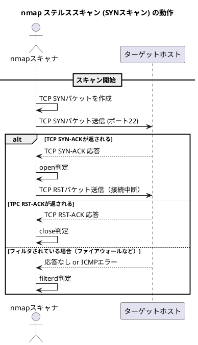
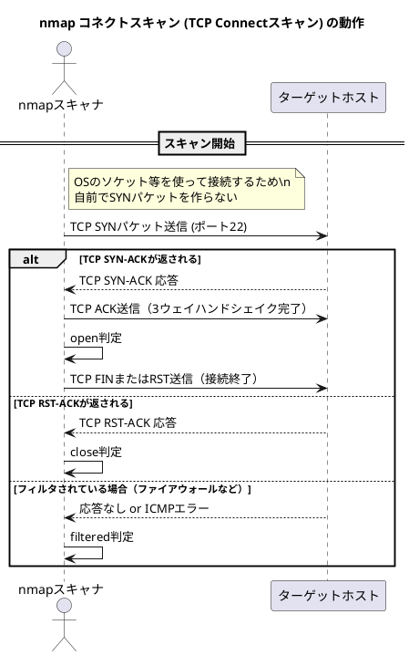

## これは何?

ポートスキャナである[Nmap](https://nmap.org/)を使用してSYN(ステルス)スキャンで`filterd`判定になっているポートに対して、TCPコネクトスキャンを使うと`open`になるケースに遭遇したので防備録。

脆弱性診断などで空いているはずのportが`filterd`になってしまう時にコネクトスキャンを使うとopen判定が得られるかもしれない。

---

## 背景

- NmapのSYN(ステルス)スキャンを使ってポートスキャンを実施し，22番ポートが`filterd`になっていることを確認
- 試しにsshで通常接続をすると接続できる
- Powershellの[Test-Connection](https://learn.microsoft.com/ja-jp/powershell/module/microsoft.powershell.management/test-connection?view=powershell-7.5)を使うとopen判定

---

## port scan方法の違い

概要レベルなのでポートのopen，closeには実際には詳細な判定アルゴリズムがあるかも。

### SYNスキャン

nmapの`-sS`オプションで指定するスキャン方法。
SYNパケットを作成するためにroot権限でnmapを実行することが必要



### コネクトスキャン

nmapの`-sT`オプションで指定する。
SYNスキャンと異なり，OSのソケット等を使ってパケットを送信するため，
SYNパケットをnmap側で作る必要がないことから一般ユーザでも実行できる。



---

## なぜSYNスキャンだけがfilterd判定されてしまったのか

SYNパケットに対してターゲットホストからSYN-ACKが返されるのは両スキャン共通である。
つまり，SYNパケットの構造を見て，ファイヤーウォールなどがportスキャンだと検知している?と考えられる。

そこでWiresharkを使い，両スキャンで実際に飛んでいるSYNパケットを見てみた

### SYNスキャンのSYNパケット

■SYNスキャンのSYNパケットのサマリ

```
101	23:01:26.092031496	localhost	localhost	TCP	38268 → 22 [SYN] Seq=0 Win=1024 Len=0 MSS=1460
```


<details><summary>SYNスキャンのSYNパケット全部</summary>

```
Frame 101: 58 bytes on wire (464 bits), 58 bytes captured (464 bits) on interface lo, id 0
    Interface id: 0 (lo)
        Interface name: lo
    Encapsulation type: Ethernet (1)
    Arrival Time: May  9, 2025 23:01:26.092031496 JST
    [Time shift for this packet: 0.000000000 seconds]
    Epoch Time: 1746799286.092031496 seconds
    [Time delta from previous captured frame: 1.054054651 seconds]
    [Time delta from previous displayed frame: 0.000000000 seconds]
    [Time since reference or first frame: 16.417886480 seconds]
    Frame Number: 101
    Frame Length: 58 bytes (464 bits)
    Capture Length: 58 bytes (464 bits)
    [Frame is marked: False]
    [Frame is ignored: False]
    [Protocols in frame: eth:ethertype:ip:tcp]
    [Coloring Rule Name: TCP SYN/FIN]
    [Coloring Rule String: tcp.flags & 0x02 || tcp.flags.fin == 1]
Ethernet II, Src: 00:00:00_00:00:00 (00:00:00:00:00:00), Dst: 00:00:00_00:00:00 (00:00:00:00:00:00)
    Destination: 00:00:00_00:00:00 (00:00:00:00:00:00)
        Address: 00:00:00_00:00:00 (00:00:00:00:00:00)
        .... ..0. .... .... .... .... = LG bit: Globally unique address (factory default)
        .... ...0 .... .... .... .... = IG bit: Individual address (unicast)
    Source: 00:00:00_00:00:00 (00:00:00:00:00:00)
        Address: 00:00:00_00:00:00 (00:00:00:00:00:00)
        .... ..0. .... .... .... .... = LG bit: Globally unique address (factory default)
        .... ...0 .... .... .... .... = IG bit: Individual address (unicast)
    Type: IPv4 (0x0800)
Internet Protocol Version 4, Src: localhost (127.0.0.1), Dst: localhost (127.0.0.1)
    0100 .... = Version: 4
    .... 0101 = Header Length: 20 bytes (5)
    Differentiated Services Field: 0x00 (DSCP: CS0, ECN: Not-ECT)
        0000 00.. = Differentiated Services Codepoint: Default (0)
        .... ..00 = Explicit Congestion Notification: Not ECN-Capable Transport (0)
    Total Length: 44
    Identification: 0xd0a7 (53415)
    Flags: 0x00
        0... .... = Reserved bit: Not set
        .0.. .... = Don't fragment: Not set
        ..0. .... = More fragments: Not set
    ...0 0000 0000 0000 = Fragment Offset: 0
    Time to Live: 41
    Protocol: TCP (6)
    Header Checksum: 0xc322 [validation disabled]
    [Header checksum status: Unverified]
    Source Address: localhost (127.0.0.1)
    Destination Address: localhost (127.0.0.1)
Transmission Control Protocol, Src Port: 38268, Dst Port: 22, Seq: 0, Len: 0
    Source Port: 38268
    Destination Port: 22
    [Stream index: 2]
    [Conversation completeness: Incomplete (35)]
    [TCP Segment Len: 0]
    Sequence Number: 0    (relative sequence number)
    Sequence Number (raw): 817639011
    [Next Sequence Number: 1    (relative sequence number)]
    Acknowledgment Number: 0
    Acknowledgment number (raw): 0
    0110 .... = Header Length: 24 bytes (6)
    Flags: 0x002 (SYN)
        000. .... .... = Reserved: Not set
        ...0 .... .... = Nonce: Not set
        .... 0... .... = Congestion Window Reduced (CWR): Not set
        .... .0.. .... = ECN-Echo: Not set
        .... ..0. .... = Urgent: Not set
        .... ...0 .... = Acknowledgment: Not set
        .... .... 0... = Push: Not set
        .... .... .0.. = Reset: Not set
        .... .... ..1. = Syn: Set
            [Expert Info (Chat/Sequence): Connection establish request (SYN): server port 22]
                [Connection establish request (SYN): server port 22]
                [Severity level: Chat]
                [Group: Sequence]
        .... .... ...0 = Fin: Not set
        [TCP Flags: ··········S·]
    Window: 1024
    [Calculated window size: 1024]
    Checksum: 0xa172 [unverified]
    [Checksum Status: Unverified]
    Urgent Pointer: 0
    Options: (4 bytes), Maximum segment size
        TCP Option - Maximum segment size: 1460 bytes
            Kind: Maximum Segment Size (2)
            Length: 4
            MSS Value: 1460
    [Timestamps]
        [Time since first frame in this TCP stream: 0.000000000 seconds]
        [Time since previous frame in this TCP stream: 0.000000000 seconds]

```

</details>


### コネクトスキャンのSYNパケット

■コネクトスキャンのSYNパケットのサマリ

```
116	23:01:31.039355471	localhost	localhost	TCP	35246 → 22 [SYN] Seq=0 Win=65495 Len=0 MSS=65495 SACK_PERM=1 TSval=696235419 TSecr=0 WS=1024
```

<details><summary>コネクトスキャンのSYNパケット全部</summary>

```
Frame 116: 74 bytes on wire (592 bits), 74 bytes captured (592 bits) on interface lo, id 0
    Interface id: 0 (lo)
        Interface name: lo
    Encapsulation type: Ethernet (1)
    Arrival Time: May  9, 2025 23:01:31.039355471 JST
    [Time shift for this packet: 0.000000000 seconds]
    Epoch Time: 1746799291.039355471 seconds
    [Time delta from previous captured frame: 0.135641772 seconds]
    [Time delta from previous displayed frame: 4.947283336 seconds]
    [Time since reference or first frame: 21.365210455 seconds]
    Frame Number: 116
    Frame Length: 74 bytes (592 bits)
    Capture Length: 74 bytes (592 bits)
    [Frame is marked: False]
    [Frame is ignored: False]
    [Protocols in frame: eth:ethertype:ip:tcp]
    [Coloring Rule Name: TCP SYN/FIN]
    [Coloring Rule String: tcp.flags & 0x02 || tcp.flags.fin == 1]
Ethernet II, Src: 00:00:00_00:00:00 (00:00:00:00:00:00), Dst: 00:00:00_00:00:00 (00:00:00:00:00:00)
    Destination: 00:00:00_00:00:00 (00:00:00:00:00:00)
        Address: 00:00:00_00:00:00 (00:00:00:00:00:00)
        .... ..0. .... .... .... .... = LG bit: Globally unique address (factory default)
        .... ...0 .... .... .... .... = IG bit: Individual address (unicast)
    Source: 00:00:00_00:00:00 (00:00:00:00:00:00)
        Address: 00:00:00_00:00:00 (00:00:00:00:00:00)
        .... ..0. .... .... .... .... = LG bit: Globally unique address (factory default)
        .... ...0 .... .... .... .... = IG bit: Individual address (unicast)
    Type: IPv4 (0x0800)
Internet Protocol Version 4, Src: localhost (127.0.0.1), Dst: localhost (127.0.0.1)
    0100 .... = Version: 4
    .... 0101 = Header Length: 20 bytes (5)
    Differentiated Services Field: 0x00 (DSCP: CS0, ECN: Not-ECT)
        0000 00.. = Differentiated Services Codepoint: Default (0)
        .... ..00 = Explicit Congestion Notification: Not ECN-Capable Transport (0)
    Total Length: 60
    Identification: 0x5692 (22162)
    Flags: 0x40, Don't fragment
        0... .... = Reserved bit: Not set
        .1.. .... = Don't fragment: Set
        ..0. .... = More fragments: Not set
    ...0 0000 0000 0000 = Fragment Offset: 0
    Time to Live: 64
    Protocol: TCP (6)
    Header Checksum: 0xe627 [validation disabled]
    [Header checksum status: Unverified]
    Source Address: localhost (127.0.0.1)
    Destination Address: localhost (127.0.0.1)
Transmission Control Protocol, Src Port: 35246, Dst Port: 22, Seq: 0, Len: 0
    Source Port: 35246
    Destination Port: 22
    [Stream index: 3]
    [Conversation completeness: Complete, NO_DATA (39)]
    [TCP Segment Len: 0]
    Sequence Number: 0    (relative sequence number)
    Sequence Number (raw): 3977393822
    [Next Sequence Number: 1    (relative sequence number)]
    Acknowledgment Number: 0
    Acknowledgment number (raw): 0
    1010 .... = Header Length: 40 bytes (10)
    Flags: 0x002 (SYN)
        000. .... .... = Reserved: Not set
        ...0 .... .... = Nonce: Not set
        .... 0... .... = Congestion Window Reduced (CWR): Not set
        .... .0.. .... = ECN-Echo: Not set
        .... ..0. .... = Urgent: Not set
        .... ...0 .... = Acknowledgment: Not set
        .... .... 0... = Push: Not set
        .... .... .0.. = Reset: Not set
        .... .... ..1. = Syn: Set
            [Expert Info (Chat/Sequence): Connection establish request (SYN): server port 22]
                [Connection establish request (SYN): server port 22]
                [Severity level: Chat]
                [Group: Sequence]
        .... .... ...0 = Fin: Not set
        [TCP Flags: ··········S·]
    Window: 65495
    [Calculated window size: 65495]
    Checksum: 0xfe30 [unverified]
    [Checksum Status: Unverified]
    Urgent Pointer: 0
    Options: (20 bytes), Maximum segment size, SACK permitted, Timestamps, No-Operation (NOP), Window scale
        TCP Option - Maximum segment size: 65495 bytes
            Kind: Maximum Segment Size (2)
            Length: 4
            MSS Value: 65495
        TCP Option - SACK permitted
            Kind: SACK Permitted (4)
            Length: 2
        TCP Option - Timestamps: TSval 696235419, TSecr 0
            Kind: Time Stamp Option (8)
            Length: 10
            Timestamp value: 696235419
            Timestamp echo reply: 0
        TCP Option - No-Operation (NOP)
            Kind: No-Operation (1)
        TCP Option - Window scale: 10 (multiply by 1024)
            Kind: Window Scale (3)
            Length: 3
            Shift count: 10
            [Multiplier: 1024]
    [Timestamps]
        [Time since first frame in this TCP stream: 0.000000000 seconds]
        [Time since previous frame in this TCP stream: 0.000000000 seconds]

```

</details>

### まとめ

とりあえず，SYNスキャンとコネクトスキャンで飛んでいるSYNパケットは完全に同じものではないことがわかった。
実際のファイヤーウォールの検知ルールがわからない限り，詳細の分析はできないので今回はここまでとする。

もし，本来空いているはずのportがスキャナによりfilterd判定された場合には，別のスキャン方法を試すと面白いと思う。
