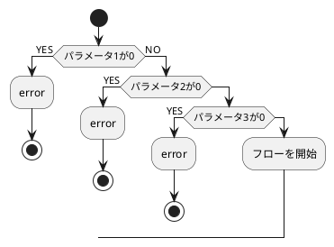
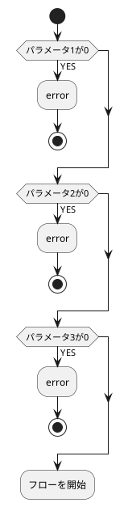
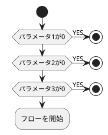
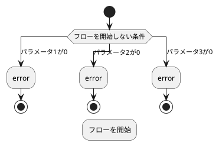
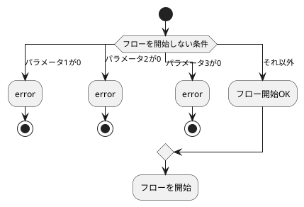

## 背景

PlantUMLを使っているとネストが深くなってしまうことがある。
そこで，プログラミング言語早期returnをしてみたところ，生成される図が微妙な感じになってしまった。

本記事では，ネストを浅くしつつ見やすいPlantUMLの図を作成する方法を検討する。

結論だけ知りたい方へ
- [暫定解決策1](https://qiita.com/sigma_devsecops/items/e932aff7111fd066470c#%E6%9A%AB%E5%AE%9A%E8%A7%A3%E6%B1%BA%E7%AD%961)
- [暫定解決策2](https://qiita.com/sigma_devsecops/items/e932aff7111fd066470c#%E6%9A%AB%E5%AE%9A%E8%A7%A3%E6%B1%BA%E7%AD%962)

---

## ネストが深くなる例

```
@startuml
skinparam backgroundColor #FFFFFF

start
if (パラメータ1が0) then (YES)
  :error;
  stop
else (NO)
  if (パラメータ2が0) then (YES)
    :error;
    stop
  else
    if (パラメータ3が0) then (YES)
      :error;
      stop
    else
      :フローを開始;
    end if
  end if
end if
  
@enduml
```
:::note
図は普通だが，スクリプト側のネストが深くなるのが気になる。
:::



---

## 早期リターンを使ってみる

### とりあえず，早期リターンを適用すると縦長になってしまう

```
@startuml
skinparam backgroundColor #FFFFFF

start
if (パラメータ1が0) then (YES)
  :error;
  stop
end if
if (パラメータ2が0) then (YES)
  :error;
  stop
end if
if (パラメータ3が0) then (YES)
  :error;
  stop
end if
:フローを開始;  
@enduml
```

:::note warn
早期リターン時に処理が一つでも入ると(下記の場合には`error`)図が縦長になってしまい見にくくなってしまう。
:::



### 暫定解決策1

:::note info
分岐してすぐに`stop`に行く場合には図は縦長にならず，図もシンプルで良い感じ。
:::

```
@startuml
skinparam backgroundColor #FFFFFF

start
if (パラメータ1が0) then (YES)
  stop
end if
if (パラメータ2が0) then (YES)
  stop
end if
if (パラメータ3が0) then (YES)
  stop
end if
:フローを開始;  
@enduml
```


---

## 早期リターン後に直stopできない場合`if`の変わりに`case`を使う

```
@startuml
skinparam backgroundColor #FFFFFF

start
switch (フローを開始しない条件)
  case (パラメータ1が0)
    :error;
    stop
  case (パラメータ2が0)
    :error;
    stop
  case (パラメータ3が0)
      :error;
      stop
endswitch
:フローを開始;
@enduml
```
:::note warn
横長にはなったが，フローが途中で切れてしまう。
:::



### 暫定解決策2

`case`に早期リターンしない場合(下記では`それ以外`)を追加し，そこに要素を追加することで今までのガード節での問題が解決できた。

- 図が縦長にならない
- フローが一応つながる

```
@startuml
skinparam backgroundColor #FFFFFF

start
switch (フローを開始しない条件)
  case (パラメータ1が0)
    :error;
    stop
  case (パラメータ2が0)
    :error;
    stop
  case (パラメータ3が0)
      :error;
      stop
  case (それ以外)
      :フロー開始OK;
endswitch
:フローを開始;
@enduml
```



---

## 感想とまとめ

- こんな記事を書いておいて今更だが，フローを作成するためのPlantUMLのスクリプトはネストが深くなって可読性が悪くても生成される図がわかりやすければそんなに問題は無い気がする。PlantUMLのスクリプトの可読性を上げることは手段であって目的でない。
- 早期リターンするなら直で`stop`に向かわせるのが一番簡単で良さそう。[暫定解決策1](https://qiita.com/sigma_devsecops/items/e932aff7111fd066470c#%E6%9A%AB%E5%AE%9A%E8%A7%A3%E6%B1%BA%E7%AD%961)
- 間に処理を挟むなら`case`を使う。[暫定解決策2](https://qiita.com/sigma_devsecops/items/e932aff7111fd066470c#%E6%9A%AB%E5%AE%9A%E8%A7%A3%E6%B1%BA%E7%AD%962)
