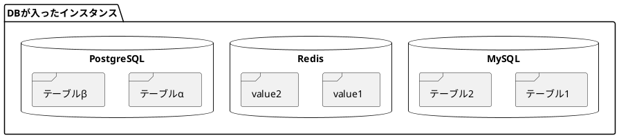
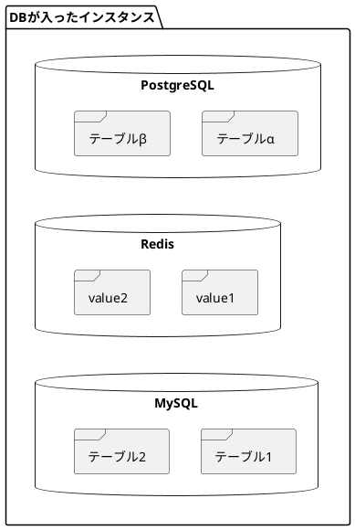

## 解決したいこと

図が横長になってしまい，視認性が悪いため，要素を縦並びにしたい。

例



:::note info
PlantUMLのソースがみたい方は「Markdownで本文を見る」をクリックしてください。

:::
---

## 解決策

非表示の矢印をつけることで縦並びを強制することができる。

```
    MySQL -[hidden]up- Redis
    Redis -[hidden]up- PostgreSQL
```


