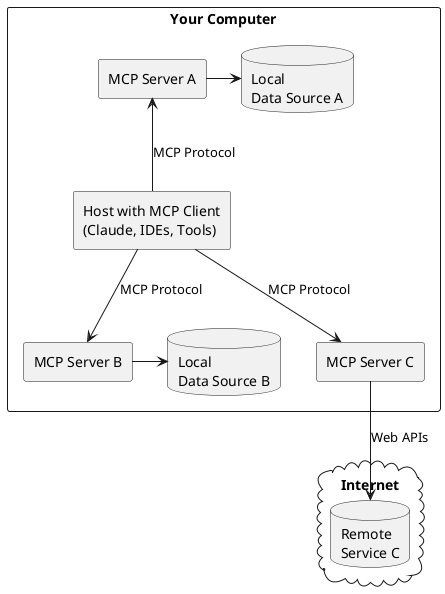
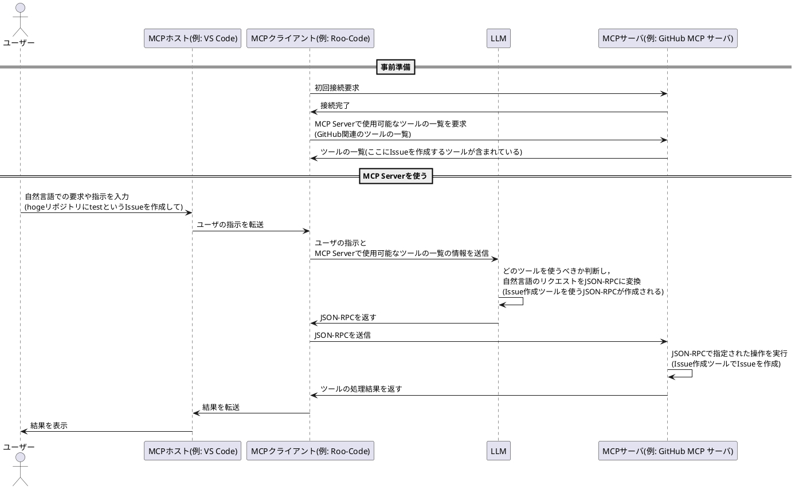

## これは何?

MCP(Model Context protocol)は2024年11月にAnthoropicによって発表されたプロトコルであり，LLMとツールをつなぐような役割を担っている。

だが，最近(2025年3月中旬くらい?)から目にする機会が増えてきた気がしている。
理由は完全に自分の想像であるが，AIエージェントの登場により，MCPに対するユーザの興味が再燃したのではないだろうか。

そこで，MCPの定義及び，MCPサーバの使用を追体験することで仕組みを理解できるよう，記事を執筆した。

MCPサーバにまだ触ったことが無いが気になっている方などの役に経てば幸いである。

---

## MCPとは

> Today, we're open-sourcing the Model Context Protocol (MCP), a new standard for connecting AI assistants to the systems where data lives, including content repositories, business tools, and development environments. Its aim is to help frontier models produce better, more relevant responses.[^1]

MCPの目的: コンテンツ・リポジトリ、ビジネス・ツール、開発環境など、データが存在するシステムにAIアシスタントを接続して，モデルのレスポンスを良くすること。

> MCP is an open protocol that standardizes how applications provide context to LLMs.[^2]

MCP: LLMにコンテキストを共有するためのプロトコル

> General architecture
> At its core, MCP follows a client-server architecture where a host application can connect to multiple servers:
> - MCP Hosts: Programs like Claude Desktop, IDEs, or AI tools that want to access data through MCP
> - MCP Clients: Protocol clients that maintain 1:1 connections with servers
> - MCP Servers: Lightweight programs that each expose specific capabilities through the standardized Model Context Protocol
> - Local Data Sources: Your computer’s files, databases, and services that MCP servers can securely access
> - Remote Services: External systems available over the internet (e.g., through APIs) that MCP servers can connect to[^2]


(著作権回避のため，PlantUMLで似たような図を作成)

ざっくり関係を整理すると以下のような感じ。

- MCPホスト: MCPクライアントを使い，MCPサーバにアクセスする。e.g. IDEやClaude Desktop等
- MCPサーバ: MCPに則って何かしらの機能を公開するサーバ。ローカルやリモートのリソースに接続して使う。

### JSON-RPC 2.0の使用

> All transports use JSON-RPC 2.0 to exchange messages. See the specification for detailed information about the Model Context Protocol message format.[^3]

注目すべきは，MCPクライアントとMCPサーバ間の通信が[JSON-RPC 2.0](https://www.jsonrpc.org/specification)を使用していること。

:::note info
RPCとは: Remote Procedure Callの略でRESTと並ぶAPI設計のアーキテクチャスタイルである。[^4]
:::

> JSON-RPC is a stateless, light-weight remote procedure call (RPC) protocol. Primarily this specification defines several data structures and the rules around their processing. It is transport agnostic in that the concepts can be used within the same process, over sockets, over http, or in many various message passing environments. It uses JSON (RFC 4627) as data format.[^5]

要するにJSON-RPCとはJSONを使ったRPCということらしい。

#### JSON-RPC 2.0の使用例

[^5]をもとにsumという合計値を求めるmethodを例に説明する。

リクエストは以下の形式である。

- `jsonrpc`: jsonrcpのバージョンのため，2.0固定。
- `method`: 呼び出すメソッド固定
- `params`: メソッドの呼び出しに使用するパラメータ
- `id`: クライアント識別子

```json
{"jsonrpc": "2.0", "method": "sum", "params": [1, 2, 3, 4], "id": 1}
```

レスポンスは以下の形式である。

- `jsonrpc`: 2.0固定
- `result`: 結果
- `error`: 正常処理の場合には含まれない
- `id`: リクエストと同じ値を使う。

```json
{"jsonrpc": "2.0", "result": 10, "id": 1}
```

---

## 公式のMCPサーバを使ってみる

https://github.com/modelcontextprotocol/servers/tree/main/src/github

これを使い，GitHubにIssueを立ててみる実験を行う。

### 環境

- VSCode + [Roo Code](https://marketplace.visualstudio.com/items?itemName=RooVeterinaryInc.roo-cline)
- Model claude-3-5-haiku-20241022 (多分なんでもいい)

### 環境構築

#### リポジトリのクローン(任意)

MCPサーバを建てるには

- ローカルでDocker buildしてイメージを作成しておく
- npxを使う

の2通りの方法がある。npxを使う場合にはMCPサーバを勝手に起動してくれるので、リポジトリのクローンや環境構築は不要。、

:::note info
自分はネットワークの問題か，Docker build中のnpm installがおそすぎて待ちきれないので一旦npxを使って動作検証をすることにした。
:::

#### AnthoropicのAPIを買う

https://console.anthropic.com/settings/keys

から5ドル分を購入した。

#### GitHubのtokenを取得

https://github.com/settings/personal-access-tokens

ここから作成する。
今回は，Issueが作成できる権限のみを付与する。

:::note warn
Repository accessを`Public repositories`にしているとRead-only accessのためPermissionsにRepository permissionsが表示されない。


:::


#### VSCodeの設定

- [Roo Code](https://marketplace.visualstudio.com/items?itemName=RooVeterinaryInc.roo-cline)をインストールしていなければインストールする。
- Roo CodeにAnthoropicのAPI keyを設定する。Extensionsの設定画面から設定できる
  
- Roo CodeにMCPサーバを追加する。今回はnpx経由なので以下をコピペして編集する[^6]。
  
    ```json
    {
      "mcpServers": {
         "github": {
          "command": "npx",
          "args": [
            "-y",
            "@modelcontextprotocol/server-github"
          ],
          "env": {
            "GITHUB_PERSONAL_ACCESS_TOKEN": "<YOUR_TOKEN>"
          }
        }
      }
    }
    ```
    MCP Serversを選択し，Edit MCP Settingsで設定をjsonで記載する。
    
    

### 動作確認

MCPサーバを使われないと困るので，ROO CODEに以下の内容でTaskを作成します。

「localのMCPサーバを使い，`git@github.com:RyosukeDTomita/memo`にtitleと内容がhogeのIssuesを作成して」


これでIssuesを作成することができました。


動作を少し追ってみると以下のような動きをしている。

1. MCPホスト(Roo-Cline)により，MCPクライアントが呼び出される。これにより，MPCサーバへ送信するrequestを作成する。これはユーザの作成したタスクをもとに作成されたJSONが含まれている。
2. MCPサーバはリクエストを受け取る。
3. index.tsの`server.setRequestHandler()`[^7]でリクエストのJSONから`request.params.arguments`を取得する。これをもとに使用するメソッドが決定される。
4. src/github/operations/issues.tsのcreateIssue()[^8]が呼び出され，Issuesが作成される。

---

## まとめ: 結局MCP Serverはどのように動いているのか

MCPを使用することで，JSON-RPCを介してツールやリソースを操作することができる。
動作としては以下のような流れになる。

前提: 事前にMCPクライアントがMCP Serverに接続し，使用可能なツールの情報を取得してある。

1. ユーザーが自然言語で要求や指示をMPCホストに入力
2. MCPクライアント経由でLLMを使用し，自然言語の指示を解析。MCP Serverのどのツールを使用するのが適切化判断する。
3. LLMが指示をMCPの仕様に沿ったJSON形式に変換し，MCPクライアントに返す
4. MCPクライアントは構造化されたJSONリクエストをMCPサーバに送信する
5. MCPサーバがそのリクエストを処理し、指定されたツールやリソースにアクセス
6. 必要な処理を実行し、ユーザに結果を返す。

### GitHubのMCP Serverを使ってIssueを作成する例


(PlantUMLで作成)

---

## Future work

https://modelcontextprotocol.io/docs/concepts/architecture

MCPのCore architectureを見ると，主な機能は3種類に大別される。

- Resources
- Prompts
- Tools

これらについて実際に実装してみたい。

---

## Reference

[^1]: https://www.anthropic.com/news/model-context-protocol
[^2]: https://modelcontextprotocol.io/introduction
[^3]: https://modelcontextprotocol.io/docs/concepts/architecture
[^4]: https://aws.amazon.com/jp/compare/the-difference-between-rpc-and-rest/
[^5]: https://www.jsonrpc.org/specification
[^6]: https://github.com/modelcontextprotocol/servers/tree/main/src/github#npx
[^7]: https://github.com/modelcontextprotocol/servers/blob/f99299de2b3e1d99ff0302874ade1329451022b9/src/github/index.ts#L208
[^8]: https://github.com/modelcontextprotocol/servers/blob/f99299de2b3e1d99ff0302874ade1329451022b9/src/github/operations/issues.ts#L71
