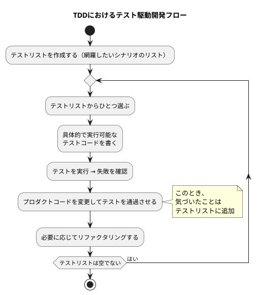

## これは何?

https://increments.connpass.com/event/359655/

Qiita Tech Festaお疲れ様会の発表資料を作るための記事。

TDD(テスト駆動開発)を取り入れたことで、開発がしやすくなったり、少し視座が上がったと感じているのでこの体験を共有する。

---

## TDD(テスト駆動開発)とは

https://shop.ohmsha.co.jp/shopdetail/000000004967/

こういうのは原典を読むべきだと思っているので、時間がある方はKent Beckのテスト駆動開発を読むことをおすすめする。
時間のない人は上記書籍の訳者のt-wadaさんが翻訳した[【翻訳】テスト駆動開発の定義](https://t-wada.hatenablog.jp/entry/canon-tdd-by-kent-beck)を読むと良い。

> 1. 網羅したいテストシナリオのリスト（テストリスト）を書く
> 2. テストリストの中から「ひとつだけ」選び出し、実際に、具体的で、実行可能なテストコードに翻訳し、テストが失敗することを確認する
> 3. プロダクトコードを変更し、いま書いたテスト（と、それまでに書いたすべてのテスト）を成功させる（その過程で気づいたことはテストリストに追加する）
> 4. 必要に応じてリファクタリングを行い、実装の設計を改善する
> 5. テストリストが空になるまでステップ2に戻って繰り返す

定義として厳密に決まっているわけではないと思うが、自動テスト、開発者テスト、テストファーストの良いところどりをした開発手法だと思って良さそう。

> 自動テストとは、開発対象のコードに対するテストもコードとして書いて（テストコード⁠）⁠、そのコードを実行することでテストの実施を自動的に行っていく取り組みのことです。
> 自動テストの強みの源となる、自動テストが必ず満たすべき性質が2つあります。自己検証可能であることと、繰り返し可能であることです。[保守しやすく変化に強いソフトウェアを支える柱　自動テストとテスト駆動開発⁠⁠、その全体像](https://gihyo.jp/article/2024/01/automated-test-and-tdd)

> Self-Validating（自己検証可能）
>「自己検証可能」とは、テストには成功か失敗かの2つの結果しかないこと、そしてテスト自身が人間の目を介さずに成功か失敗かを自分で判断できるということです。標準出力などにテスト対象の出力がそのまま出ており、人間が目で見て期待値と一致するかどうか確かめているようなテストは、自己検証を行っていません。多くの場合は、期待値との比較のために、テスティングフレームワークが提供する関数やアサーション（表明）が使われます。
> Repeatable（繰り返し可能）
>「繰り返し可能」とは、テストがいつでもどこでも同じように動くということです。昼でも深夜でも、誰の手元でもCI（継続的インテグレーション）サーバ上でも、同じように動かなければなりません。自動テストは、人の手を介さず、実行するたびに毎回同じように動かなければなりません。テスト実行後に人の手でデータをリセットしたりファイルを消したりしているなら、繰り返し可能にはなっていません。[保守しやすく変化に強いソフトウェアを支える柱　自動テストとテスト駆動開発⁠⁠、その全体像](https://gihyo.jp/article/2024/01/automated-test-and-tdd)

> 開発者が自分でテストコードを書くこと、開発者自身が自動テストを書きながら開発することは「開発者テスト（Developer Testing）」と呼ばれます。[【翻訳】テスト駆動開発の定義](https://t-wada.hatenablog.jp/entry/canon-tdd-by-kent-beck)

> 実装の後に書くのでなく、実装を書く前にテストを書いたらどうだろうか、という観点で始まったのがテストファーストの考え方です。[保守しやすく変化に強いソフトウェアを支える柱　自動テストとテスト駆動開発⁠⁠、その全体像](https://gihyo.jp/article/2024/01/automated-test-and-tdd)

> テスト駆動開発（TDD）はテストファーストの利点を伸ばし、欠点を補うために生まれました。設計面でのテストファーストの強みを活かしつつ、保守性を上げるためにリファクタリングが組み込まれています。またやりすぎ、考えすぎ（スコープクリープ）を避けるために、イテレーティブな開発手順とインクリメンタルな設計の要素が組み込まれました。[保守しやすく変化に強いソフトウェアを支える柱　自動テストとテスト駆動開発⁠⁠、その全体像](https://gihyo.jp/article/2024/01/automated-test-and-tdd)

---

## TDDとの出会い おらこんな環境いやだ〜TDDするだ〜

ここからはTDDと出会って自分の開発体験がどのようによくなったかを書いていく。

### テストがなくて辛い

テストがもともとない状態で開発をしており、以下のような問題が発生していた。

- コードに変更を加えるたびにデプロイして手動でテストが必須
- デグレが発生していることに気が付かない

### 自動テストが欲しくて、TDDを学んでみた

そのため、Kent Beck氏の著書「テスト駆動開発」を読んだ。
自分は、ある機能の実装を行っている途中で他の部分の実装をリファクタリングしたくなったり、最初から設計にこだわったコードを書いてしまうことがあったので、TDDの一連の流れを実施することでやるべきことに集中できることに感動した。

- 作りたい機能に対して1つテストを書く
- そのテストが失敗するところまでコードを書く
- テストを通るように仮実装する
- リファクタリングをする

また、もともとの目的にあったようにテストがあることで勇気を持って開発を進められそうだと確信した。

### 後からTDDを導入するには?

超えるべき壁が結構あると思っている

#### ローカルの開発環境の整備

- ローカルでコードを書き、デプロイしてテストを実行するのは筋が悪い
- ローカルでテストを実施できるように開発環境を整えるほうがいい
- 開発環境構築の手順の整備も必要

#### どんなテストを書いていいかがわからない

https://book.mynavi.jp/ec/products/detail/id=134252

本を読み、とりあえず以下を意識している。

- なるべく粗結合なコードを書く
    - ドメインのコードを隔離する
- 古典派的に振る舞いをテストにすることで壊れにくいテストをかく

ベストプラクティスの勉強も大切だが、手を動かして経験をつみ、直感を鍛えるしかないと最近感じている。

---

## TDDを導入してよかったこと

- TDDのフローに沿うことでやるべきことに集中できるようになった
- テストがあることの安心感
- テストが書きやすいコードを意識することで、以前よりも設計に目がいくようになった
- AIに実装を任せることへの抵抗が薄れ、本質的な部分に向き合うようになった

---

## おまけ: AIエージェントとTDD

### AIと並走する文脈

前々回の #QiitaBashで少し触れた

https://www.youtube.com/watch?v=lP9SbkZCDSI

TDDのテストを一つ書いて一つ通すというやり方はAIと並走する上ですごくやりやすいと思う

- AIと一緒にテストコードを書く(文法とか曖昧でも書きやすい)
- AIと一緒にテストコードを通す
    - テストが実施できるまではAIにまかせてもいいかも
    - テストが通るように実装すれば最低限の品質は保証される
- リファクタリングのアイデアを試しやすい

### AIに全部委託する文脈

https://aws.amazon.com/jp/blogs/news/introducing-kiro/

Kiroは、ユーザと壁打ちしながらドキュメントをAIに作ってもらってから開発をするという形をIDEという形でフレームワーク化してくれた。

1. 要求定義書(requirements.md)
2. 設計書(design.md)
3. タスクリスト(tasks.md)

3で作成したタスクリストをベースに「t-wadaさんのTDDで実装して」とClaude Codeにお願いすると割といい感じで作ってくれる。

単純に仕様書駆動開発をするよりは、テストが正当なことを確認しておけば品質は上がると思う。

ただ、業務レベルでソースを見ないのはまだ怖いのでテストだけ残して[強くてニューゲーム](https://aoai-ai-coding.mizchi.workers.dev/#7)するとか考えてもいいかもしれない。

少なくとも、既存のTDDが必ずしも正解ではない気がしている。
